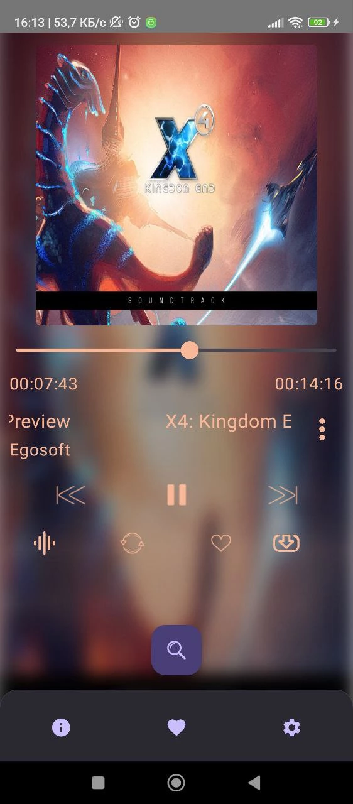
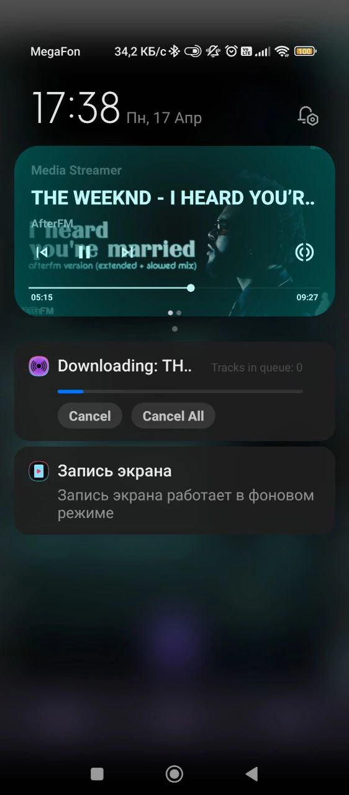

**MediaStreamer**
-----------------

## **Developer**
[Paranid5](https://github.com/dinaraparanid)

## **About App**
**Media Streamer** is a music player Android app that **plays audio files from YouTube and cashes them.**

## **Current Status**
**Alpha V 0.0.0.1**

**Implemented features:**
1. Media Playback
2. Audio Cashing

**TODO:**
1. Video Cashing
2. Playback of cashed videos and favourites system
3. Equalizer, Bass Booster and other sound effects
4. App customization and settings

## **System Requirements**
**Android 5.0** or higher

Stable internet connection to play audio and cash videos is required

## **License**
*GNU Public License V 3.0*
