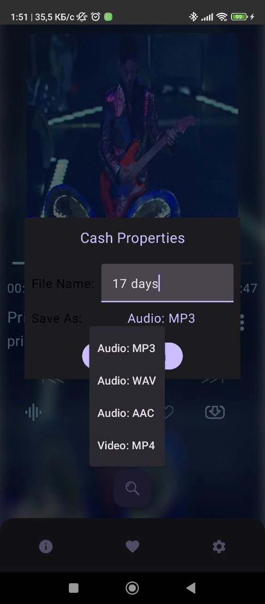

**MediaStreamer**
-----------------

## **Developer**
[Paranid5](https://github.com/dinaraparanid)

## **About App**
**Media Streamer** is a music player Android app that
can **play audio files from YouTube and cash them.**

## **Current Status**
**Alpha V 0.0.0.2**

**Implemented features:**
1. Media Playback
2. Audio Cashing
3. Video Cashing

**TODO:**
1. Update notifications
2. Equalizer, Bass Booster and other sound effects
3. Playback of cashed videos and favourites system
4. App customization and settings

## **System Requirements**
**Android 5.0** or higher

Stable internet connection to play audio and cash videos is required

## **License**
*GNU Public License V 3.0*
